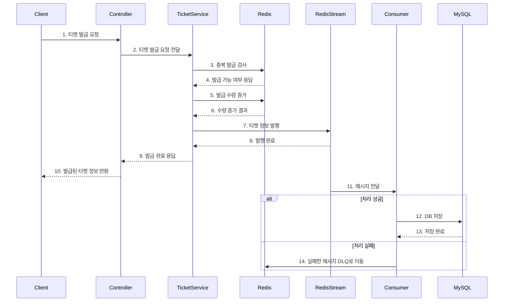
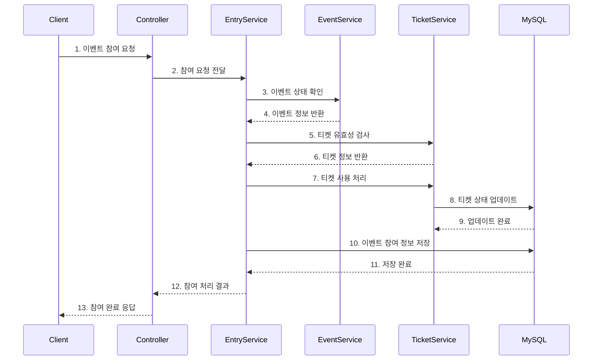
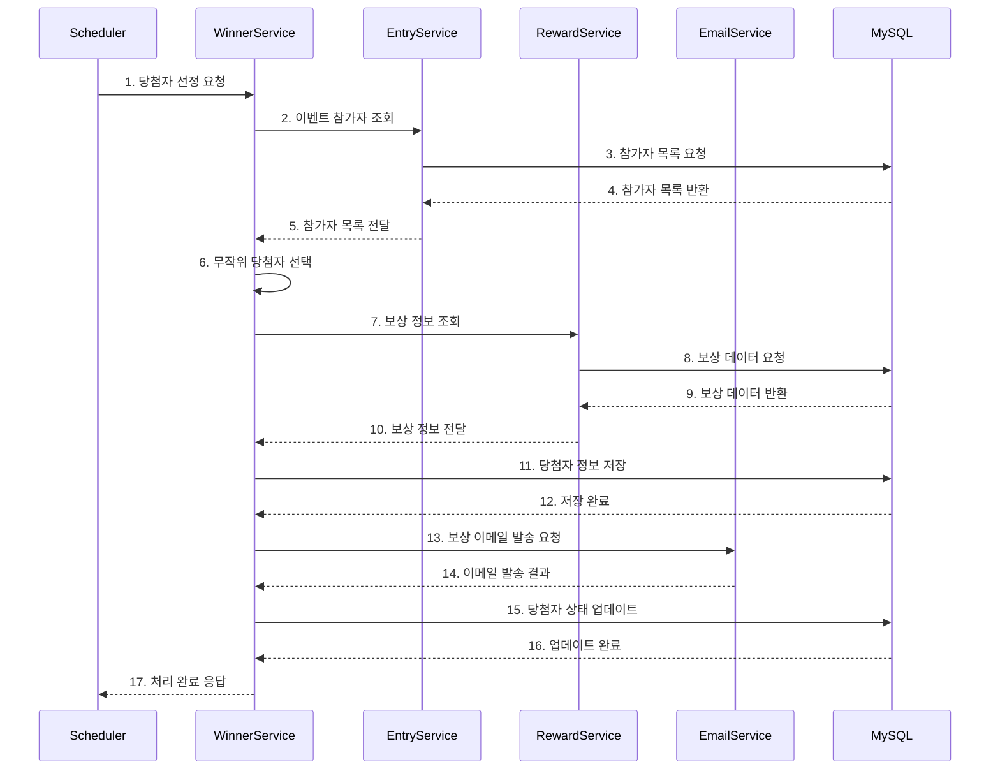

# Random Ticket 프로젝트


## 목차
- [프로젝트 소개](#프로젝트-소개)
- [프로젝트 목적](#프로젝트-목적)
- [핵심 기술 스택](#핵심-기술-스택)
- [프로젝트 구조](#프로젝트-구조)
- [핵심 기능](#핵심-기능)
  - [티켓 발급 및 이벤트 참여](#티켓-발급-및-이벤트-참여)
  - [이벤트 참여](#이벤트-참여)
  - [당첨자 선정 및 보상 발송](#당첨자-선정-및-보상-발송)
- [기술 블로그](#기술-블로그)
- [모듈별 README](#모듈별-readme)
- [라이센스](#라이센스)

## 프로젝트 소개

Random Ticket은 Mystery Gift를 사용자들에게 나눠주는 이벤트 참여 및 당첨자 관리 시스템입니다. 사용자들은 발급받은 티켓으로 이벤트에 참여하고, 당첨자는 무작위로 선정되어 보상을 받을 수 있습니다. 

본 프로젝트는 헥사고날 아키텍처 패턴을 참고하여 설계되었으며, Redis를 활용한 동시성 제어와 메시지 큐 패턴을 구현하여 대용량 트래픽 환경에서의 구동을 고려하였습니다.

## 프로젝트 목적

- **객체 지향 설계 원칙 적용**: 도메인 모델 중심의 설계와 객체 지향 원칙을 적용하여 유지보수성 향상
- **동시성 문제 해결**: Redis를 활용한 분산 락과 메시지 큐 패턴으로 동시성 이슈 해결
- **성능 최적화**: 비동기 처리 및 캐싱 전략을 통한 시스템 성능 개선
- **모듈 분리**: 헥사고날 아키텍처를 통한 관심사 분리 및 모듈 독립성 확보

## 핵심 기술 스택

### 백엔드
- **Java 17**
- **Spring Boot 3.4.3**
- **Spring Security** & **JWT**
- **Spring Data JPA** & **QueryDSL**
- **Redis** & **Redisson**
- **MySQL**

### 인프라 & 도구
- **Gradle**
- **AWS S3**
- **Spring Mail** & **Thymeleaf**

## 프로젝트 구조

헥사고날 아키텍처 패턴을 기반으로 설계된 프로젝트 구조:

```
random-ticket/
├── application/            # 애플리케이션 진입점 및 API 레이어
├── system-domain/          # 핵심 비즈니스 로직 및 도메인 정의
├── system-infra/           # 외부 인프라(DB, Redis, S3 등) 어댑터
├── system-core/            # 공통 유틸리티 및 에러 처리
└── independently-available/ # 독립적으로 실행 가능한 배치 모듈
```

## 핵심 기능

### 티켓 발급 및 이벤트 참여



### 이벤트 참여


### 당첨자 선정 및 보상 발송



## 기술 블로그

프로젝트 개발 과정에서 마주한 기술적 도전과 해결 방법에 대한 블로그 글:

- [Redis를 활용한 티켓 발급 시스템의 동시성 문제 분석 및 개선](https://velog.io/@hyeonseob22/Redis%EB%A5%BC-%ED%99%9C%EC%9A%A9%ED%95%9C-%ED%8B%B0%EC%BC%93-%EB%B0%9C%EA%B8%89-%EC%8B%9C%EC%8A%A4%ED%85%9C%EC%9D%98-%EB%8F%99%EC%8B%9C%EC%84%B1-%EB%AC%B8%EC%A0%9C-%EB%B6%84%EC%84%9D-%EB%B0%8F-%EA%B0%9C%EC%84%A0)
- [Redis Stream 사용시 발생한 직렬화 문제 트러블 슈팅](https://velog.io/@hyeonseob22/Redis-Stream-%EC%82%AC%EC%9A%A9%EC%8B%9C-%EB%B0%9C%EC%83%9D%ED%95%9C-%EC%A7%81%EB%A0%AC%ED%99%94-%EB%AC%B8%EC%A0%9C-%ED%8A%B8%EB%9F%AC%EB%B8%94-%EC%8A%88%ED%8C%85)
- [Redis Stream Consumer 트러블 슈팅](https://velog.io/@hyeonseob22/Redis-Stream-Consumer-Trouble-Shooting)
- [Redis Stream에서 발생하는 따옴표 중첩 문제 해결하기](https://velog.io/@hyeonseob22/Redis-Stream%EC%97%90%EC%84%9C-%EB%B0%9C%EC%83%9D%ED%95%98%EB%8A%94-%EB%94%B0%EC%98%B4%ED%91%9C-%EC%A4%91%EC%B2%A9-%EB%AC%B8%EC%A0%9C-%ED%95%B4%EA%B2%B0%ED%95%98%EA%B8%B0)
- [멀티모듈 프로젝트 설계](https://velog.io/@hyeonseob22/Temp-Title-gsdhgvye)

## 모듈별 README

- [application](./application/README.md)
- [system-domain](./system-domain/README.md)
- [system-infra](./system-infra/README.md)
- [system-core](./system-core/README.md)
- [independently-available](./independently-available/README.md)

## 라이센스

이 프로젝트는 Apache License 2.0 라이센스에 따라 배포됩니다.
